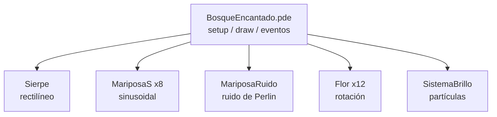

# Bosque Encantado — SIMU 26

Escenario interactivo nocturno (con transición a día) desarrollado en **Processing**. Habitan en él una sierpe, mariposas, flores giratorias y luciérnagas, cada una con un tipo de movimiento diferente. El usuario puede interactuar con las criaturas y la iluminación en tiempo real.

## Tecnologías


## Características

- **5 tipos de movimiento** implementados desde cero: rectilíneo, sinusoidal, ruido de Perlin, rotación y sistema de partículas
- **Transición día/noche** suave mediante interpolación (`lerp`)
- **Interactividad** en tiempo real: atracción al ratón, explosiones con clic, alternancia día/noche
- **Generación procedural** del escenario (cielo, suelo, árboles, hierba) sin imágenes externas
- **Capas de dibujo** ordenadas para crear sensación de profundidad

## Controles

| Acción | Efecto |
|--------|--------|
| Clic en cualquier punto | Explosión de luciérnagas en ese punto |
| Mover el ratón | Atrae a las mariposas sinusoidales |
| Tecla `D` | Alterna entre modo día y modo noche |
| Tecla `R` | Reinicia todas las criaturas |

## Criaturas y movimientos

| Criatura | Tipo de movimiento | Descripción |
|----------|--------------------|-------------|
| `Sierpe` | Rectilíneo | Velocidad constante con rebote en bordes; cuerpo de 14 segmentos |
| `MariposaS` (×8) | Sinusoidal | Onda Y con amplitud, frecuencia y fase propias; se atrae al ratón |
| `MariposaRuido` | Ruido de Perlin | Velocidad calculada con `noise(t)`, vuelo orgánico con estela de 30 puntos |
| `Flor` (×12) | Rotación | Ángulo acumulado + pulsación de escala con `sin()` |
| `SistemaBrillo` | Partículas | Pool de 200 luciérnagas ambientales + explosiones al clic |

## Arquitectura



El sketch principal (`BosqueEncantado.pde`) inicializa y actualiza cada criatura en su `draw()`
loop; cada tipo de movimiento vive en su propia clase/archivo `.pde` (una responsabilidad = un
tipo de movimiento), sin dependencias entre ellas — el sketch principal es el único punto que las
conoce a todas y gestiona la interacción del usuario (ratón, teclado) y la transición día/noche.

## Estructura del proyecto

```
BosqueEncantado/
├── BosqueEncantado.pde   # setup(), draw(), eventos, dibujo del escenario
├── Sierpe.pde            # Movimiento rectilíneo con rebote
├── MariposaRuido.pde     # Movimiento por ruido de Perlin
├── MariposaS.pde         # Movimiento sinusoidal con atracción al ratón
├── Flor.pde              # Rotación con pulsación de escala
└── SistemaBrillo.pde     # Sistema de partículas (Luciernaga + SistemaBrillo)
```

## Requisitos y ejecución

1. Instalar [Processing 4](https://processing.org/download)
2. Abrir la carpeta `BosqueEncantado/` desde **File → Open**
3. Pulsar el botón **Run** (`Ctrl+R`)

No se requieren librerías adicionales; el sketch usa únicamente la API estándar de Processing.

## Autores

Proyecto académico — **Universidad de Murcia**, asignatura **Simulación**, práctica 1, curso 2025-2026.

- José Luis García Valverde (jl.garciavalverde@um.es)

## Licencia

MIT — ver [`LICENSE`](./LICENSE).
